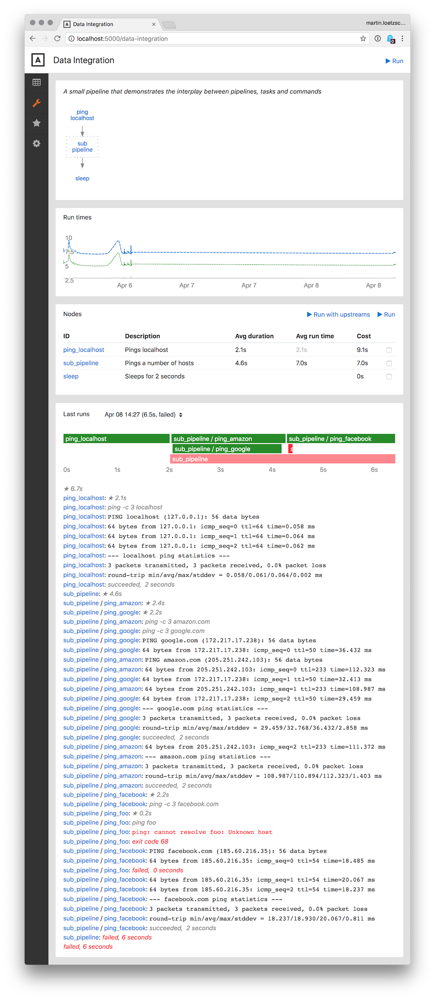
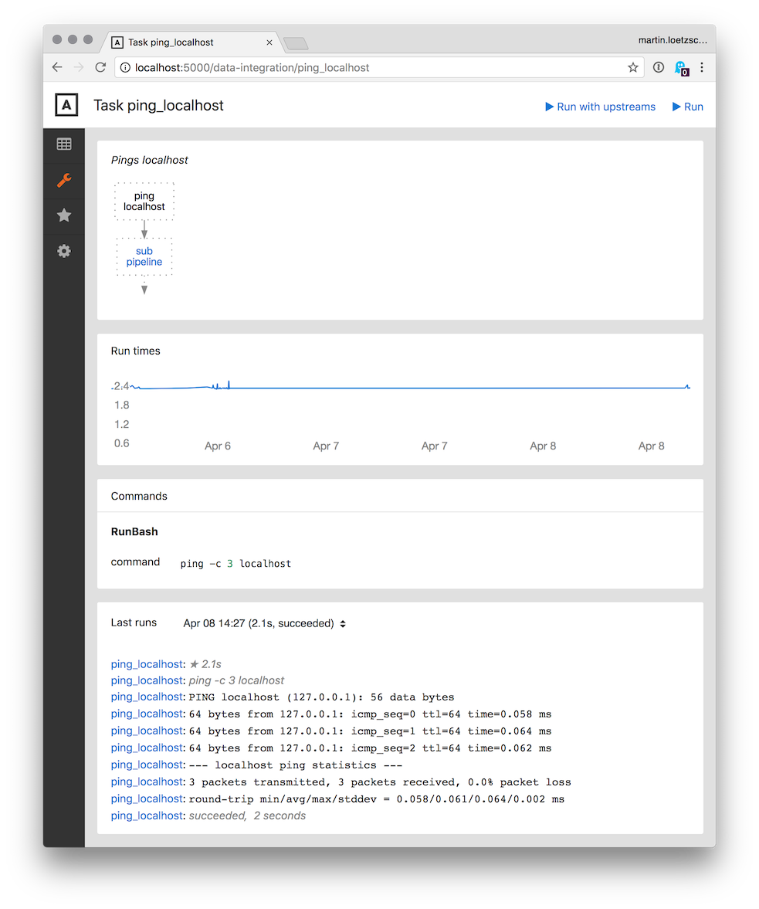
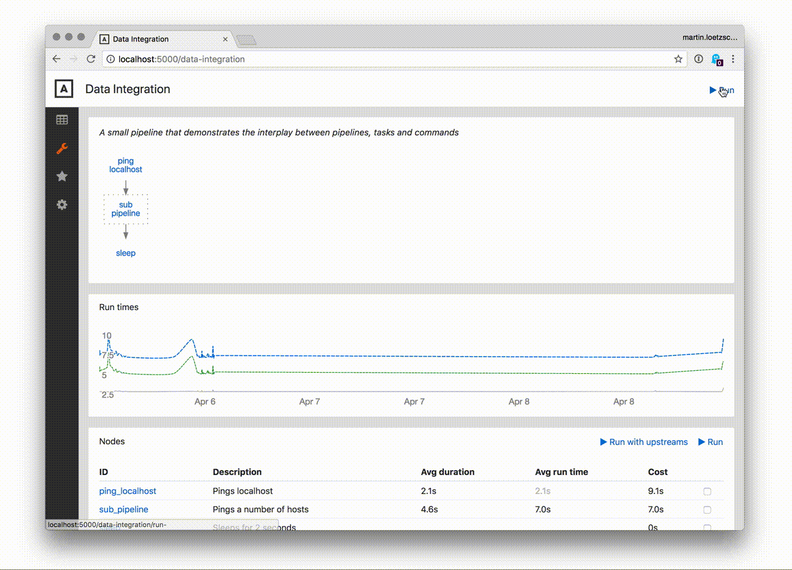

# Example

Here is a pipeline "demo" consisting of three nodes that depend on each other: the task `ping_localhost`, the pipeline `sub_pipeline` and the task `sleep`:

```python
from mara_pipelines.commands.bash import RunBash
from mara_pipelines.pipelines import Pipeline, Task
from mara_pipelines.cli import run_pipeline, run_interactively

pipeline = Pipeline(
    id='demo',
    description='A small pipeline that demonstrates the interplay between pipelines, tasks and commands')

pipeline.add(Task(id='ping_localhost', description='Pings localhost',
                  commands=[RunBash('ping -c 3 localhost')]))

sub_pipeline = Pipeline(id='sub_pipeline', description='Pings a number of hosts')

for host in ['google', 'amazon', 'facebook']:
    sub_pipeline.add(Task(id=f'ping_{host}', description=f'Pings {host}',
                          commands=[RunBash(f'ping -c 3 {host}.com')]))

sub_pipeline.add_dependency('ping_amazon', 'ping_facebook')
sub_pipeline.add(Task(id='ping_foo', description='Pings foo',
                      commands=[RunBash('ping foo')]), ['ping_amazon'])

pipeline.add(sub_pipeline, ['ping_localhost'])

pipeline.add(Task(id='sleep', description='Sleeps for 2 seconds',
                  commands=[RunBash('sleep 2')]), ['sub_pipeline'])
```

Tasks contain lists of commands, which do the actual work (in this case running bash commands that ping various hosts).

&nbsp;

In order to run the pipeline, a PostgreSQL database needs to be configured for storing run-time information, run output and status of incremental processing:

```python
import mara_db.auto_migration
import mara_db.config
import mara_db.dbs

mara_db.config.databases \
    = lambda: {'mara': mara_db.dbs.PostgreSQLDB(host='localhost', user='root', database='example_etl_mara')}

mara_db.auto_migration.auto_discover_models_and_migrate()
```

Given that PostgresSQL is running and the credentials work, the output looks like this (a database with a number of tables is created):

```
Created database "postgresql+psycopg2://root@localhost/example_etl_mara"

CREATE TABLE data_integration_file_dependency (
    node_path TEXT[] NOT NULL,
    dependency_type VARCHAR NOT NULL,
    hash VARCHAR,
    timestamp TIMESTAMP WITHOUT TIME ZONE,
    PRIMARY KEY (node_path, dependency_type)
);

.. more tables
```

## CLI UI

This runs a pipeline with output to stdout:

```python
from mara_pipelines.cli import run_pipeline

run_pipeline(pipeline)
```


&nbsp;

And this runs a single node of pipeline `sub_pipeline` together with all the nodes that it depends on:

```python
run_pipeline(sub_pipeline, nodes=[sub_pipeline.nodes['ping_amazon']], with_upstreams=True)
```


&nbsp;


And finally, there is some sort of menu based on [pythondialog](http://pythondialog.sourceforge.net/) that allows to navigate and run pipelines like this:

```python
from mara_pipelines.ui.cli import run_interactively

run_interactively()
```


## Web UI

More importantly, this package provides an extensive web interface. It can be easily integrated into any [Flask](https://flask.palletsprojects.com/) based app and the [mara example project](https://github.com/mara/mara-example-project) demonstrates how to do this using [mara-app](https://mara-app.readthedocs.io/).

For each pipeline, there is a page that shows

- a graph of all child nodes and the dependencies between them
- a chart of the overal run time of the pipeline and it's most expensive nodes over the last 30 days (configurable)
- a table of all the pipeline's nodes with their average run times and the resulting queuing priority
- output and timeline for the last runs of the pipeline




For each task, there is a page showing

- the upstreams and downstreams of the task in the pipeline
- the run times of the task in the last 30 days
- all commands of the task
- output of the last runs of the task




Pipelines and tasks can be run from the web ui directly, which is probably one of the main features of this package:


